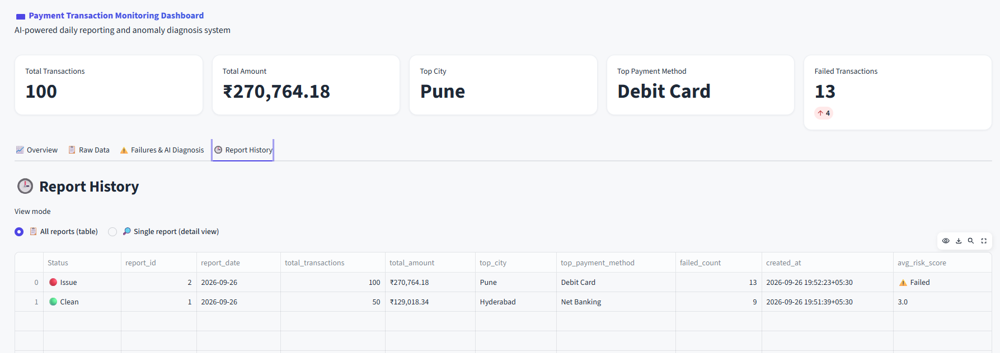
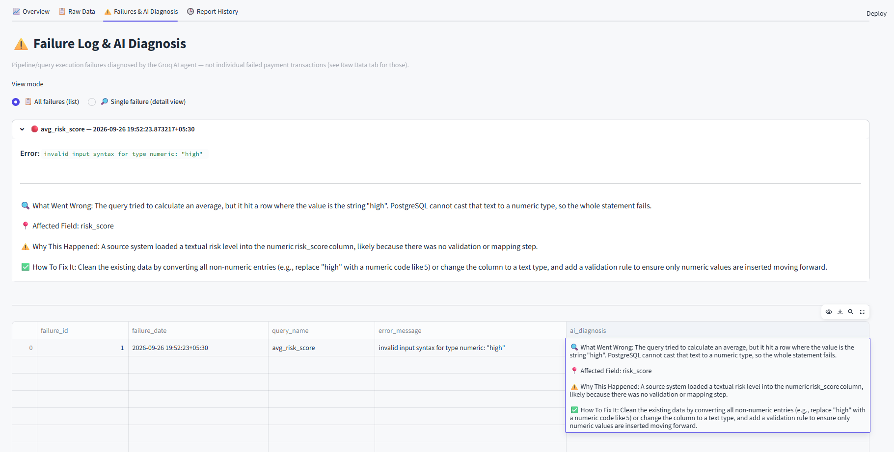
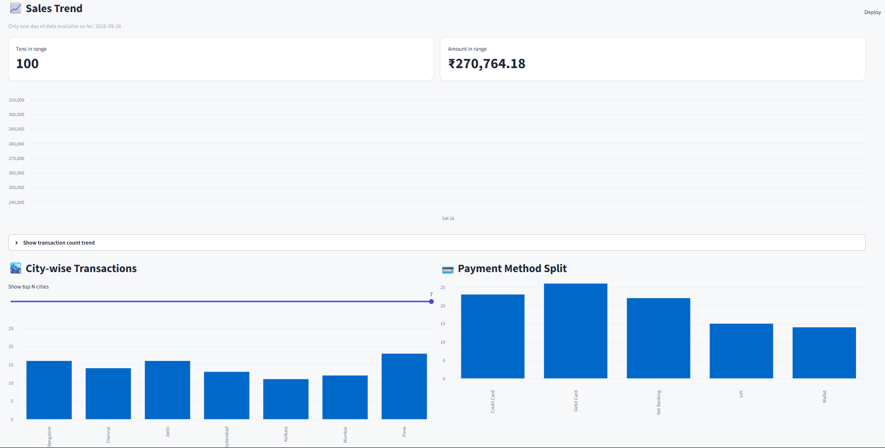
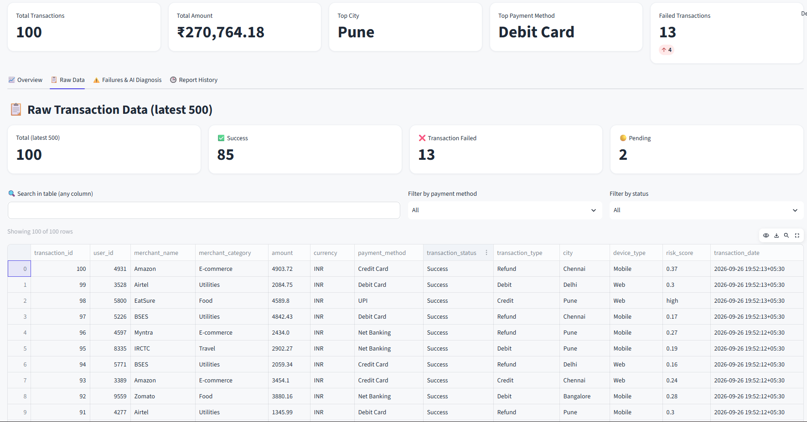
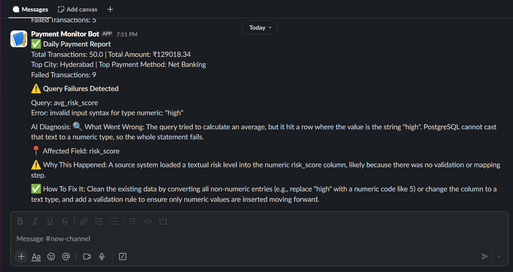
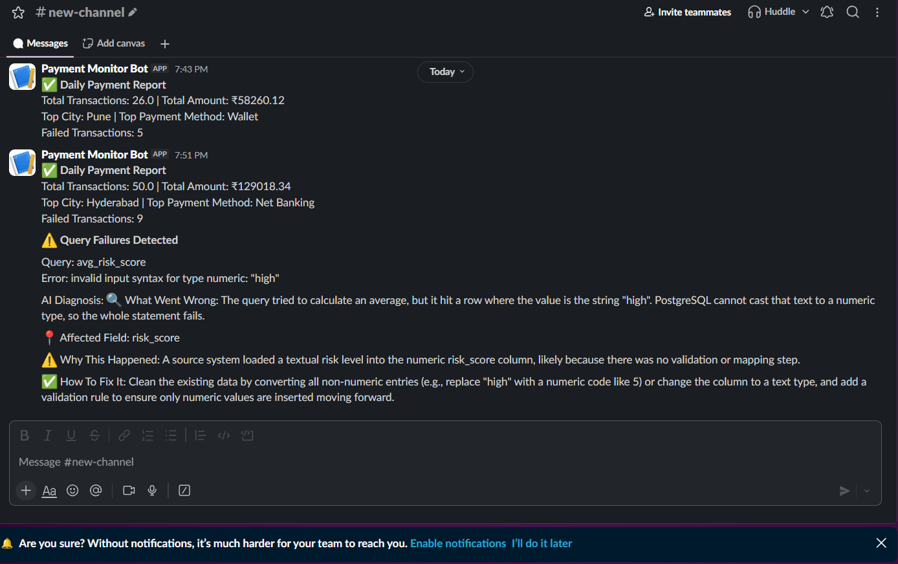

# 💳 AI-Powered Payment Transaction Monitoring & Anomaly Diagnosis System

**🔗 Live Demo:** [https://payment-monitoring-system.streamlit.app/](https://payment-monitoring-system.streamlit.app/)

An automated daily reporting pipeline for payment transaction data that doesn't just report numbers — it detects its own failures and uses an AI agent to explain *why* they happened, in plain English, with a suggested fix.

---

## 📌 What This Project Is

This is a self-monitoring, self-diagnosing data pipeline built around a simulated fintech transaction dataset. Every day, it:

1. Generates a fresh batch of payment transactions (mostly clean, occasionally with a realistic data anomaly)
2. Runs a set of business-critical SQL reports against that data
3. If a report fails because of bad data, an AI agent (Groq/Llama) automatically investigates the failure and explains the root cause
4. Sends a real-time alert to Slack — either a clean success summary, or a failure report with the AI's diagnosis
5. Makes everything — clean days and failed days — browsable on a live dashboard

It's built to mirror how a real data/ops team's daily reporting pipeline behaves, including the part most portfolio projects skip: **what happens when the data is wrong.**

---

## 🎯 Why I Built This

Most beginner SQL/data projects stop at "write some queries against a dataset." That proves syntax knowledge, but not judgment.

I wanted a project that could answer a different question: **what happens the day the data isn't clean?** Because in any real pipeline, it eventually won't be — a field changes type, a source system sends an unexpected value, a null slips through. Most tutorial projects never model that; they assume the happy path forever.

So instead of just building a reporting script, I built a pipeline that:
- Simulates that failure realistically (a controlled "chaos injection" system)
- Handles it gracefully instead of crashing silently
- Uses an LLM to do something an on-call engineer would normally have to do manually — read the error, look at the data, and explain what's wrong

---

## 🧩 The Real Problem This Solves

In production data pipelines, failures are rarely announced clearly. A cron job fails, someone gets a cryptic Postgres error in a log file, and then a human has to manually trace it back to "oh, someone put 'N/A' in a numeric column." That triage step is repetitive and slow.

This project automates that first triage step:

| Without this system | With this system |
|---|---|
| Query fails silently or logs a raw stack trace | Failure is caught, logged, and explained in plain English |
| Engineer manually inspects data to find the bad row | AI agent identifies the likely affected field and cause |
| No record of *why* past failures happened | Every failure + diagnosis is persisted and browsable |
| No visibility without opening logs | Live dashboard shows clean vs. failed runs at a glance |

---

## 🛠️ Tech Stack — And Why Each Piece, Specifically

| Layer | Choice | Why this, and not the alternatives |
|---|---|---|
| **Database** | Supabase (PostgreSQL) | Needed a database reachable from the cloud (GitHub Actions can't reach a local machine), with real relational/window-function SQL support. Free tier is generous. Neon was a close alternative — Supabase won on documentation and onboarding. SQLite was ruled out early: it's local-only and cloud automation can't reach it. |
| **Scheduler** | GitHub Actions (cron syntax) | Needed the pipeline to run without a laptop staying on 24/7. Windows Task Scheduler works but is local-machine-dependent and not resume-credible in the same way. Python's `schedule` library still needs *something* running continuously. GitHub Actions runs entirely in the cloud, free for public repos, and uses real cron syntax. |
| **Backend** | Python (`pandas`, `psycopg2`) | Natural fit for SQL + data shaping, and every other piece of this stack (AI calls, Slack, Streamlit) is Python-native — one language, no context-switching. |
| **AI Agent** | Groq API (Llama 3.3) | Needed an LLM API with a genuinely free tier with no card required, since this project only needs ~1 diagnosis call/day. OpenAI's API no longer has a no-card free tier. Gemini's free tier was a valid alternative; Groq was chosen for its very low latency (custom LPU hardware) and generous daily rate limits well beyond this project's actual usage. |
| **Notifications** | Slack Incoming Webhook | A single POST request, no SMTP setup, no deliverability issues — and it mirrors how real ops teams actually get paged for pipeline issues. |
| **Dashboard** | Streamlit (+ Streamlit Community Cloud) | Entire backend is already Python — no separate frontend stack needed. Free public hosting means a real shareable link instead of "you have to run this locally to see it." |
| **Secrets** | `.env` (local) + GitHub Secrets + Streamlit Secrets | Never hardcoded; each environment (local, GitHub Actions, Streamlit Cloud) gets its own secret store. |

**Deliberately excluded:** Docker (GitHub Actions already gives a consistent environment — an extra container layer added no real value here), and a custom FastAPI server (this is a scheduled batch job, not a service that needs to accept live requests). Keeping the stack lean was a conscious decision, not an oversight.

---

## 🏗️ Architecture

```
GitHub Actions (daily cron trigger)
        │
        ▼
generate_data.py
  → generates ~50 simulated transactions
  → ~20% of days: 1 record gets a deliberately invalid
     value (amount or risk_score as text) — "chaos injection"
        │
        ▼
main.py runs 5 reporting queries against Supabase
        │
   ┌────┴─────┐
   ▼          ▼
SUCCESS     FAILURE (bad data breaks a numeric cast)
   │          │
   │          ▼
   │    ai_agent.py → Groq API diagnoses root cause
   │          │
   │          ▼
   │    Saved to failure_logs table
   ▼          ▼
notify.py → Slack alert (success summary OR failure + AI diagnosis)
        │
        ▼
reports / failure_logs / transactions tables (Supabase)
        │
        ▼
dashboard.py (Streamlit) — reads live from Supabase,
shows KPIs, trends, raw data, failure log, and full report history
```

---

## 🔄 Complete Working Flow

1. **Daily trigger** — GitHub Actions fires the workflow on a cron schedule (or can be triggered manually anytime from the Actions tab).
2. **Data generation** — `generate_data.py` inserts a fresh batch of transactions for "today." Each day is independently decided to be a *clean day* or a *chaos day* (not per-record, per-day — so a chaos day always produces exactly one genuinely broken record).
3. **Reporting** — `main.py` runs 5 queries: total sales, top city, top payment method, failed-transaction count, and average risk score — all scoped to the current day only, so every day's report is self-contained and comparable.
4. **Failure handling** — If a query fails (a bad value breaks a numeric cast), the error and a data sample are sent to Groq, which returns a structured diagnosis: what went wrong, the affected field, why it likely happened, and how to fix it. This gets written to `failure_logs`.
5. **Reporting persistence** — Whatever succeeded gets written to `reports`; a failed metric shows as a clear "Failed" marker rather than a blank or wrong number.
6. **Notification** — A Slack message goes out immediately — a clean summary, or the failure + AI diagnosis.
7. **Dashboard** — The live Streamlit app reads directly from Supabase (no caching of stale state beyond a short TTL), so anyone opening the link sees current data: KPIs, a sales trend chart, city/payment-method breakdowns, a full raw transaction table, the failure log with AI diagnoses (viewable one at a time or as a full list), and a complete report history with a Clean/Issue status per day.

---

## 🐛 Real Issues Faced While Building This (and how they were fixed)

Building the "self-repairing" part exposed several non-obvious bugs — documenting them because they were the most instructive part of the project:

- **Per-record chaos probability guaranteed a failure almost every run.** Rolling a chaos-chance separately for each of 50 records made "all 50 clean" statistically almost impossible. Fixed by deciding chaos-or-clean **once per batch**, then injecting exactly one bad record only on chaos days.
- **Not every anomaly type actually broke a query.** Injecting bad values into `city` or `payment_method` never caused a failure, because no query casts those fields numerically — so those anomaly types were silently wasted. Narrowed chaos injection down to only the two fields (`amount`, `risk_score`) that are actually cast to `NUMERIC` in the reporting queries, so every chaos day is guaranteed to produce a diagnosable failure.
- **Stale bad data caused every subsequent run to "fail" even on clean days.** Early testing didn't scope queries to "today," so one bad record from an earlier test run kept breaking every later query until the table was truncated. Fixed by scoping all five queries to the current day.
- **Timezone mismatch between generated timestamps and the date filter.** `datetime.now()` (naive, local time) vs. Postgres's UTC-based `CURRENT_DATE` caused records to intermittently fall on the "wrong side" of the day boundary. Fixed by generating timestamps as IST-aware and filtering with `(NOW() AT TIME ZONE 'Asia/Kolkata')::date` instead of `CURRENT_DATE`.
- **"Latest report" picked the wrong row.** Sorting by `report_date` (a date, not a timestamp) meant same-day reports had no reliable tiebreaker. Fixed by sorting by `created_at` instead.
- **Partial failures needed their own visual signal.** A day where 4 of 5 metrics succeed but one fails shouldn't look identical to a fully clean day. Added a `Clean 🟢` / `Issue 🔴` status column to Report History based on whether *any* of the day's metrics came back null.

---

## 📸 Screenshots

**Dashboard KPIs + Raw Transaction Data**


**Raw Data Tab — filterable, searchable transaction table**


**Overview — Sales Trend, City & Payment Method Breakdown**


**Failures & AI Diagnosis — root cause explained automatically**


**Report History — Clean vs. Issue status per day**


**Real-time Slack Alerts — success summaries and AI-diagnosed failures**


---

## 🚀 Setup / Run Locally

```bash
git clone <your-repo-url>
cd payment-monitoring-system
python -m venv venv
venv\Scripts\activate          # Windows
pip install -r requirements.txt
```

Create a `.env` file:
```
DATABASE_URL=your_supabase_connection_string
GROQ_API_KEY=your_groq_api_key
SLACK_WEBHOOK_URL=your_slack_webhook_url
```

Run the pipeline:
```bash
python generate_data.py
python main.py
```

View the dashboard locally:
```bash
streamlit run dashboard.py
```

The production version runs automatically every day via GitHub Actions — no manual steps required.

---

## 📂 Project Structure

```
payment-monitoring-system/
├── .github/workflows/daily-report.yml   # Scheduled automation
├── generate_data.py                     # Simulated data + chaos injection
├── main.py                              # SQL reporting + failure handling
├── ai_agent.py                          # Groq-based failure diagnosis
├── notify.py                            # Slack notifications
├── dashboard.py                         # Streamlit dashboard
├── requirements.txt
└── README.md
```

---

## 🔭 Possible Future Improvements

- Data retention policy (archive reports older than N days)
- Additional KPIs (e.g. highest single transaction, hourly distribution)
- Broader anomaly types once more queries validate additional fields
- Optional FastAPI layer for on-demand report triggering outside the daily schedule

---

**Live dashboard:** [https://payment-monitoring-system.streamlit.app/](https://payment-monitoring-system.streamlit.app/)
